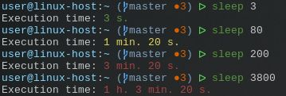

# zsh-command-time

Plugin that output `time: xx` after long commands and export `ZSH_COMMAND_TIME` variable for usage in your scripts.

It similar builin feature [REPORTTIME](http://zsh.sourceforge.net/Doc/Release/Parameters.html), but it outputs only
if user + system time >= `REPORTTIME` in config. For example:
```bash
$ time sleep 3
sleep 3  0,00s user 0,00s system 0% cpu 3,008 total
```
Sleep don't consume any cpu time and `REPORTTIME` "don't see" such idle commands.

If you need to monitor only cpu-angry commands, use `REPORTTIME` instead this plugin.


## Install with antigen
```bash
antigen bundle popstas/zsh-command-time
```

## Install with zplug
```bash
zplug "popstas/zsh-command-time"
```


## Install for oh-my-zsh

Download:
```bash
git clone https://github.com/popstas/zsh-command-time.git ~/.oh-my-zsh/custom/plugins/command-time
```
And add `command-time` to `plugins` in `.zshrc`.


## Configuration

You can override defaults in `.zshrc`:
```bash
# If command execution time above min. time, plugins will not output time.
ZSH_COMMAND_TIME_MIN_SECONDS=3

# Message to display (set to "" for disable).
ZSH_COMMAND_TIME_MSG="Execution time: %s sec"

# Message color.
ZSH_COMMAND_TIME_COLOR="cyan"

# Exclude some commands
ZSH_COMMAND_TIME_EXCLUDE=(vim mcedit)
```

### Customization
You can customize view of the plugin by redefinition of function
`zsh_command_time`. There is an example of custom definition `zsh_command_time`:
```bash
zsh_command_time() {
    if [ -n "$ZSH_COMMAND_TIME" ]; then
        hours=$(($ZSH_COMMAND_TIME/3600))
        min=$(($ZSH_COMMAND_TIME/60))
        sec=$(($ZSH_COMMAND_TIME%60))
        if [ "$ZSH_COMMAND_TIME" -le 60 ]; then
            timer_show="$fg[green]$ZSH_COMMAND_TIME s."
        elif [ "$ZSH_COMMAND_TIME" -gt 60 ] && [ "$ZSH_COMMAND_TIME" -le 180 ]; then
            timer_show="$fg[yellow]$min min. $sec s."
        else
            if [ "$hours" -gt 0 ]; then
                min=$(($min%60))
                timer_show="$fg[red]$hours h. $min min. $sec s."
            else
                timer_show="$fg[red]$min min. $sec s."
            fi
        fi
        printf "${ZSH_COMMAND_TIME_MSG}\n" "$timer_show"
    fi
}
```

You can see result of this function on the following screenshot:



Variable `$ZSH_COMMAND_TIME` contains execution time in seconds. We calculate
how many minutes and hours it was and print this information to terminal.
* Commands that were executed less than one minutes highlights by green color.
* Commands that were executed less than three minutes highlights by yellow color.
* Commands that were executed more than three minutes highlights by red color.

## Usage with [powerlevel9k](https://github.com/bhilburn/powerlevel9k) theme
You should not want to use this plugin with powerlevel9k.
Sinse powerlevel9k v0.6.0 theme have native segment 
[command_execution_time](https://github.com/bhilburn/powerlevel9k#command_execution_time)
(see [PR](https://github.com/bhilburn/powerlevel9k/pull/402)), so you can just add it to your prompt:
```bash
POWERLEVEL9K_RIGHT_PROMPT_ELEMENTS=(status background_jobs vcs command_execution_time time)
```

If you still want to use it with powerlevel9k, add custom element in `.zshrc`:
```bash
POWERLEVEL9K_CUSTOM_COMMAND_TIME="zsh_command_time"
POWERLEVEL9K_CUSTOM_COMMAND_TIME_BACKGROUND="253" # white
POWERLEVEL9K_CUSTOM_COMMAND_TIME_FOREGROUND="000" # black
```

And add element `custom_command_time` to your prompt:
```bash
POWERLEVEL9K_RIGHT_PROMPT_ELEMENTS=(status background_jobs vcs custom_command_time time)
```


## Provision with ansible
~~Plugin `command-time` included in ansible role [viasite-ansible/ansible-role-zsh](https://github.com/viasite-ansible/ansible-role-zsh)
with other useful plugins.~~ Plugin excluded from viasite-ansible.zsh, but you can still check role.
